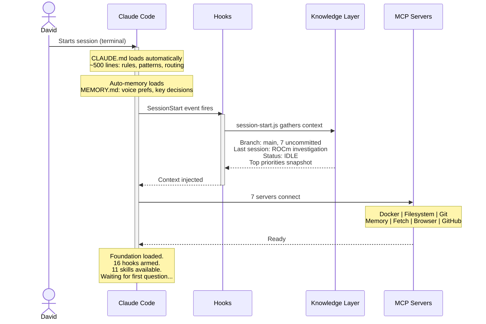
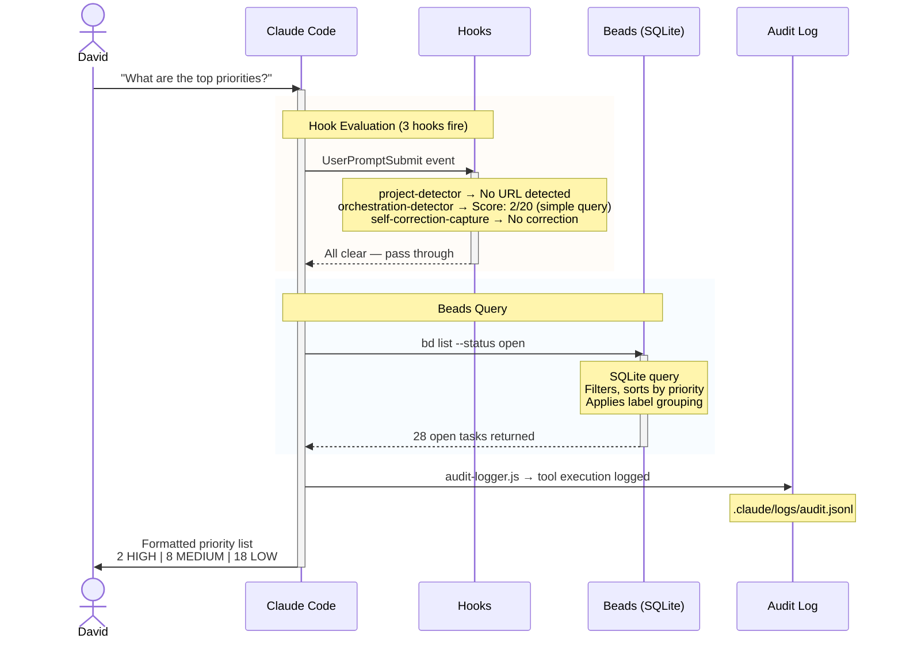
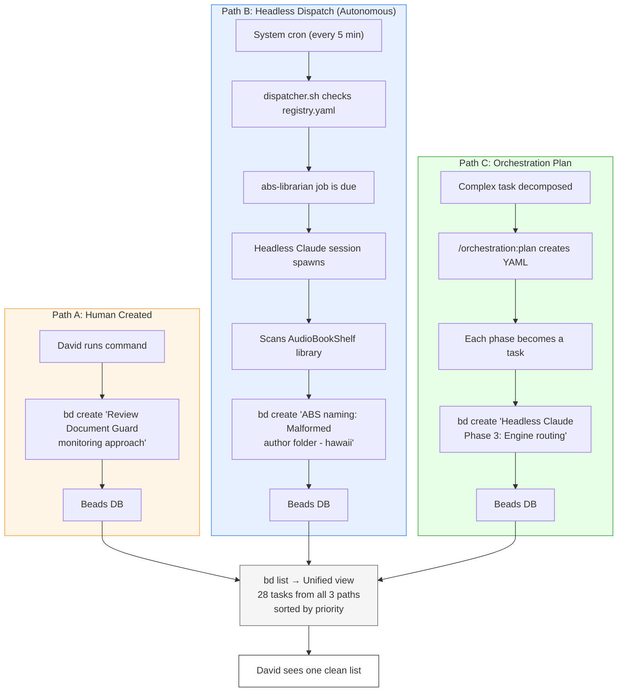
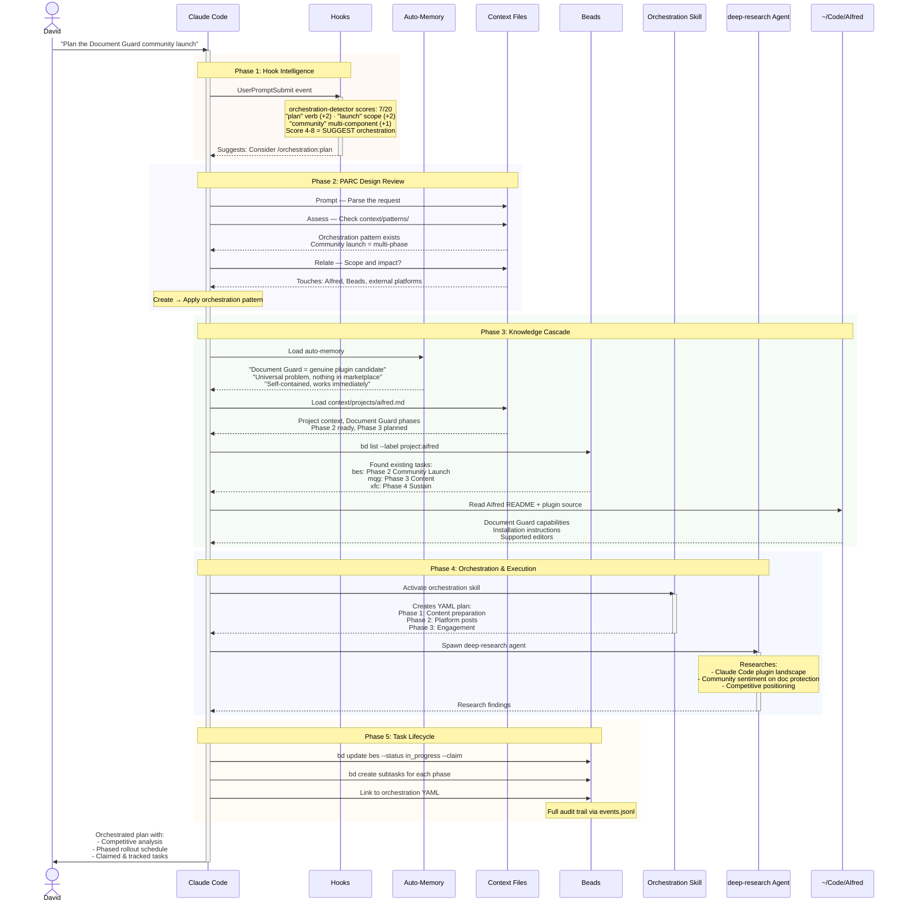
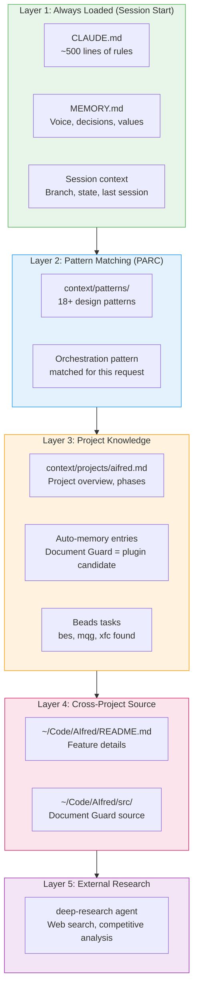
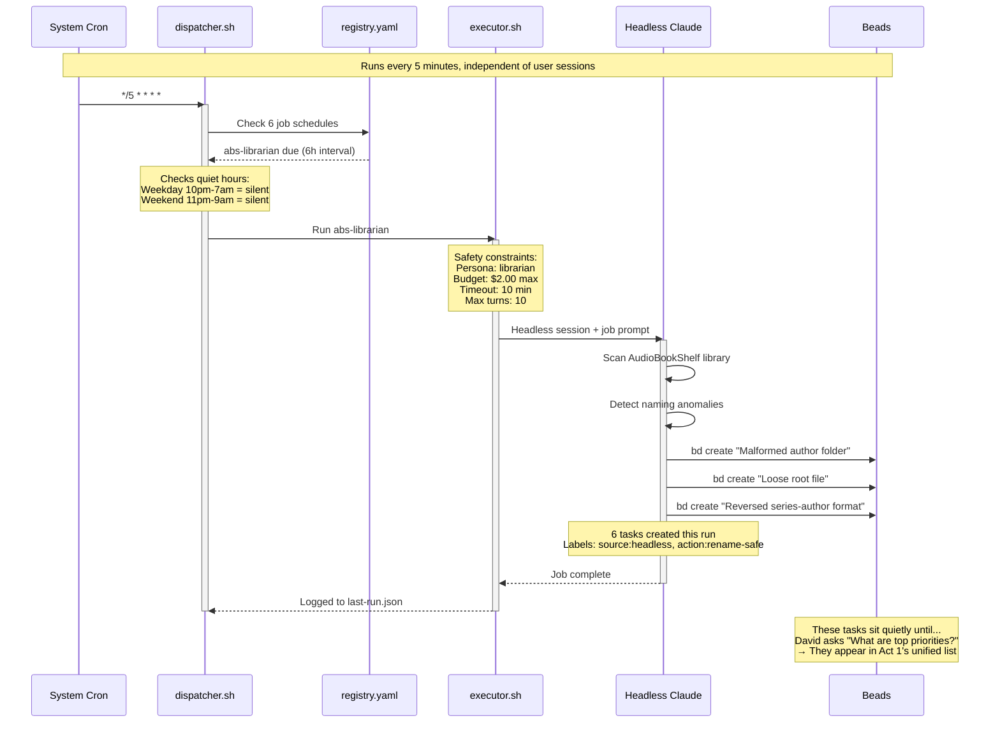
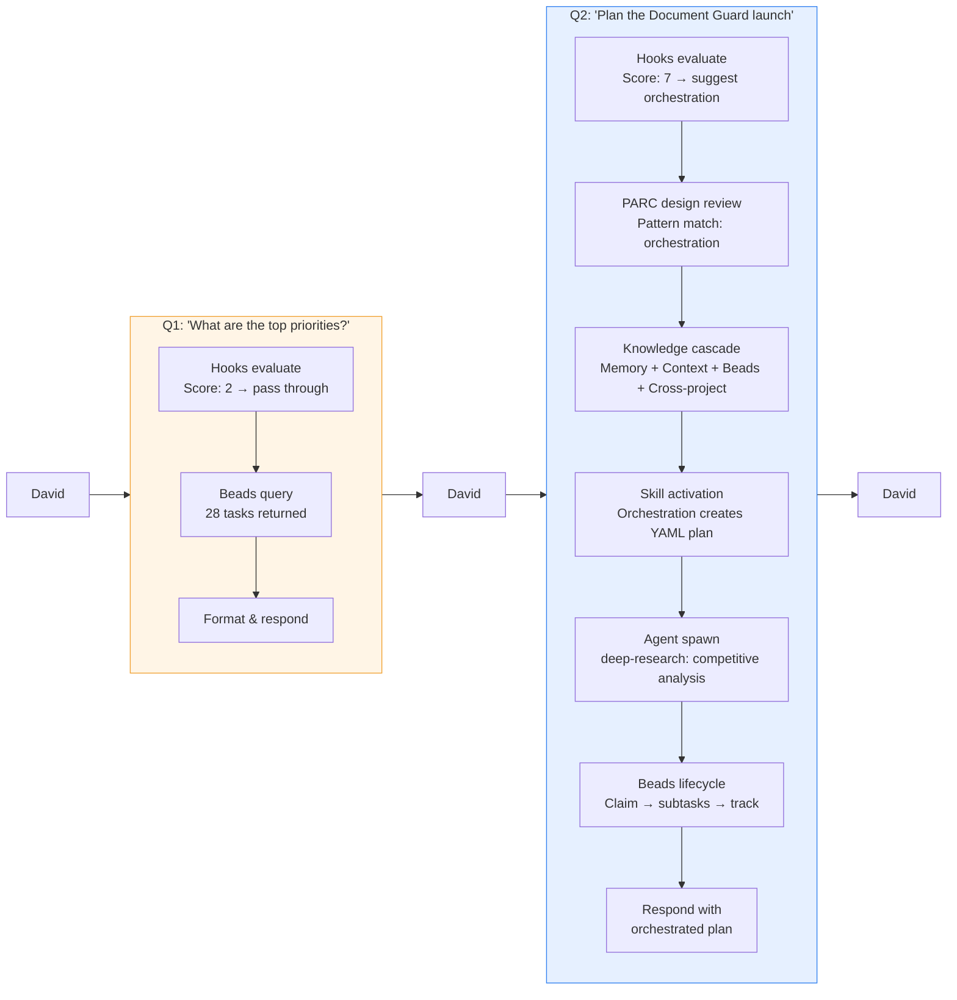

# How AIfred Answers Questions — A Visual Story

> **Purpose**: Show the **runtime behavior** of Claude Code when answering questions in sequence
> **Complements**: [[AIProjects-Architecture-Canvas]] (static structure) | [[AIProjects-Architecture-Domains]] (5 domains) | [[Agent AIFred]] (AIfred components)
> **What's different here**: Those canvases show *what exists*. This document shows *what happens when you ask a question*.

---

## The Story in 30 Seconds

Two questions. Two completely different flows. Same system.

| | Question 1 | Question 2 |
|---|---|---|
| **Ask** | "What are the top priorities?" | "Plan the Document Guard community launch" |
| **Type** | Read State | Execute Work |
| **Hook response** | Pass-through (score: 2) | Intervenes (score: 8) |
| **Systems touched** | Hooks → Beads → Response | Hooks → PARC → Memory → Context → Beads → Skills → Agents → Cross-project |
| **Story told** | Where tasks come from (3 origin paths) | How the full stack orchestrates complex work |

---

## Act 0: Session Start — The Foundation

Before any question is asked, the system loads its operating context. This is what makes the first response instant rather than cold.

### What's Loaded at Startup

| Layer | Source | Content | Token Cost |
|-------|--------|---------|------------|
| **Rules** | `CLAUDE.md` | Project rules, patterns, routing logic, MCP config | ~2,000 |
| **Memory** | `MEMORY.md` (auto-memory) | Voice preferences, key decisions, value framework | ~200 |
| **Session Context** | `session-start.js` hook | Git branch, last session summary, current state | ~500 |
| **Skills Index** | `skills/_index.md` | 11 skills, 35+ commands available | Referenced on demand |
| **MCP Connections** | `settings.json` | 7 servers for Docker, Git, files, memory, GitHub, browser, SSH | Persistent |

**Key insight**: Claude Code doesn't start from zero. By the time you type your first question, it already knows what you were doing last session, what's pending, and what tools are available.

---

## Act 1: "What are the top priorities?"

A deceptively simple question. The hooks barely activate — but the answer reveals three completely different paths that feed tasks into the system.

### But Where Did Those 28 Tasks Come From?

This is where the story gets interesting. The unified Beads database contains tasks from **three completely different origin paths**:

### What This Demonstrates

| Concept | How It Shows |
|---------|-------------|
| **Beads as unified task system** | All 28 tasks in one query, regardless of origin |
| **Headless dispatch autonomy** | Tasks appear without David doing anything (ABS librarian found 8 naming issues at 3 AM) |
| **Orchestration decomposition** | Complex plans auto-create trackable subtasks |
| **Hook intelligence** | orchestration-detector scored this 2/20 — correctly identified as a simple read query |
| **Audit trail** | Every tool call logged to JSONL (Loki-ready) |

---

## Act 2: "Plan the Document Guard community launch"

NOW the full system activates. This single question touches hooks, design patterns, memory, context files, the task system, skills, agents, and cross-project access.

### The Knowledge Cascade — What Loads and When

This is the core of how Claude Code "knows things." It's not one file — it's a cascade of increasingly specific knowledge:

### What This Demonstrates

| Concept | How It Shows |
|---------|-------------|
| **Hook intelligence** | orchestration-detector scores complexity, suggests (not forces) orchestration |
| **PARC design review** | Checks existing patterns before acting — finds orchestration pattern applies |
| **Auto-memory persistence** | Value assessment from a previous session ("genuine plugin candidate") informs today's plan |
| **Beads awareness** | Finds 3 existing Document Guard tasks — doesn't create duplicates |
| **Cross-project architecture** | AIProjects is a hub — reads AIfred code from `~/Code/AIfred/` |
| **Skill activation** | Orchestration skill creates phased YAML plan with dependencies |
| **Agent delegation** | deep-research runs autonomously for competitive analysis |
| **Capability layering** | Content creation = AI-appropriate task (needs judgment, not scriptable) |
| **Full task lifecycle** | Find existing task → claim → create subtasks → link to plan → track |
| **Audit trail** | Every tool call logged, every Beads change tracked with actor provenance |

---

## Background: The Headless Dispatch

Running silently between sessions, the dispatch system extends Claude's presence into autonomous monitoring and task creation.

### Active Headless Jobs

| Job | Schedule | Persona | What It Does |
|-----|----------|---------|-------------|
| `health-summary` | Every 6h | Investigator (read-only) | Quick infrastructure health check |
| `upgrade-discover` | Sunday 6 AM | Analyst (read + write) | Claude Code, MCP, watched task upgrades |
| `abs-librarian` | Every 6h | Librarian (permission-based) | AudioBookShelf naming cleanup |
| `doc-sync-check` | Every 24h | Investigator | Check if docs need sync with code |
| `priority-review` | Monday 7 AM | Investigator | Review Beads tasks, flag stale items |
| `plex-troubleshoot` | On-demand | Troubleshooter (safe fixes) | Diagnose Plex issues via webhook |

### What This Demonstrates

| Concept | How It Shows |
|---------|-------------|
| **Autonomous operation** | System works when David is asleep — abs-librarian runs at 3 AM |
| **Persona safety model** | Each job has permission boundaries (investigator can't modify, troubleshooter can only do safe fixes) |
| **Budget control** | Max $2/run, max 10 min, max 10 turns — prevents runaway costs |
| **Quiet hours** | Respects DND schedule — batches notifications for morning |
| **Beads integration** | Headless jobs create tasks with `source:headless` label — full provenance |
| **Capability layering** | Dispatch is bash (deterministic), jobs use Claude (judgment needed) |

---

## The Complete Picture — Q1 vs Q2

---

## Component Legend

Maps diagram participants back to actual files and tools.

| Diagram Label | Actual Component | Location |
|---------------|-----------------|----------|
| **Claude Code** | Claude Code CLI (Opus 4.6) | Terminal session |
| **Hooks** | 16 active JavaScript hooks | `.claude/hooks/*.js` |
| **Auto-Memory** | Persistent memory files | `~/.claude/projects/.../memory/` |
| **Context Files** | 171 infrastructure docs | `.claude/context/` |
| **Beads** | SQLite task database + CLI | `.beads/beads.db`, `bd` command |
| **Orchestration Skill** | Skill + YAML plans | `.claude/skills/orchestration/`, `.claude/orchestration/*.yaml` |
| **Agents** | 17 autonomous task executors | `.claude/agents/*.md` |
| **External Projects** | Code repositories | `~/Code/AIfred/`, `~/Code/...` |
| **MCP Servers** | 7 connected servers | `settings.json` MCP config |
| **Headless Dispatch** | Cron-based job system | `.claude/jobs/dispatcher.sh`, `.claude/jobs/registry.yaml` |
| **Audit Log** | JSONL event stream | `.claude/logs/audit.jsonl` |

---

## How This Relates to Other Diagrams

| Canvas | Shows | This Document Adds |
|--------|-------|-------------------|
| [[AIProjects-Architecture-Canvas]] | All 171+ components and their connections | **When** and **why** those connections activate |
| [[AIProjects-Architecture-Simple]] | Friendly analogies (house, cookbook, etc.) | **Real execution flow** through those analogies |
| [[AIProjects-Architecture-Domains]] | 5 functional domains (Startup → Monitoring) | **How domains hand off** during question processing |
| [[Agent AIFred]] | AIfred-specific components and profiles | **Runtime behavior** of those components |

This is the **dynamic complement** to those static views. Together they tell the complete story: what exists, how it's organized, and how it responds.

---

*Last updated: 2026-02-12 | Tracks AIProjects architecture as of session date*
