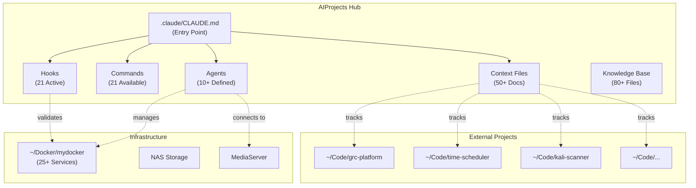
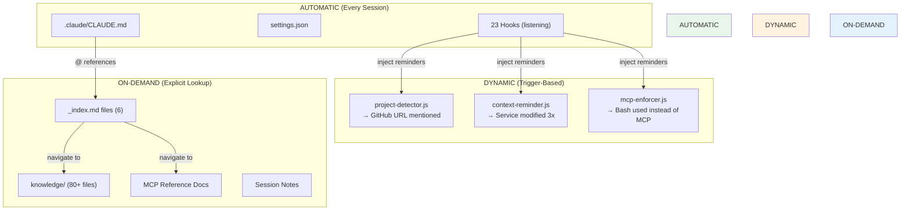
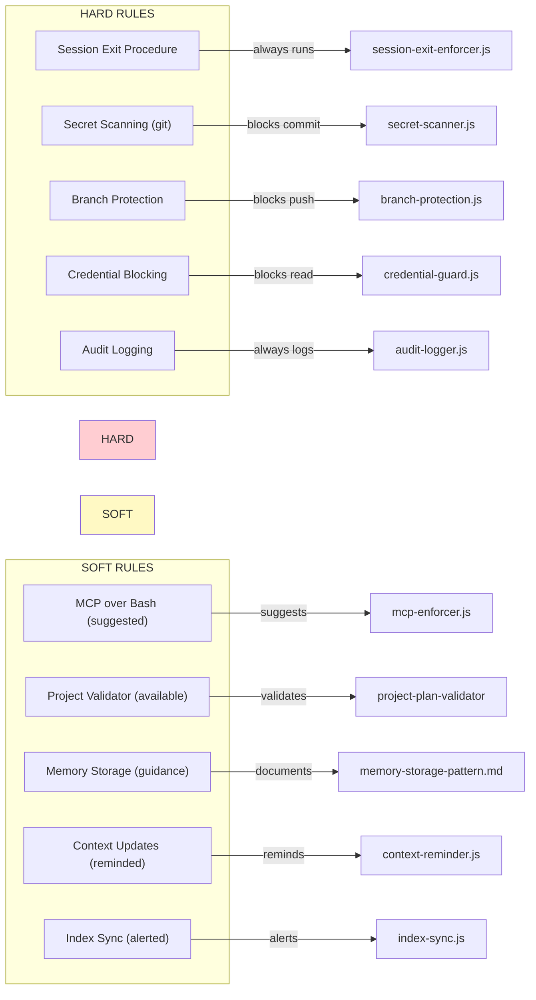
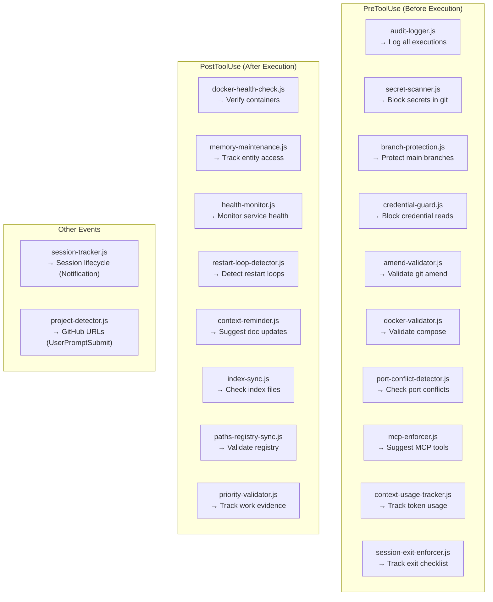
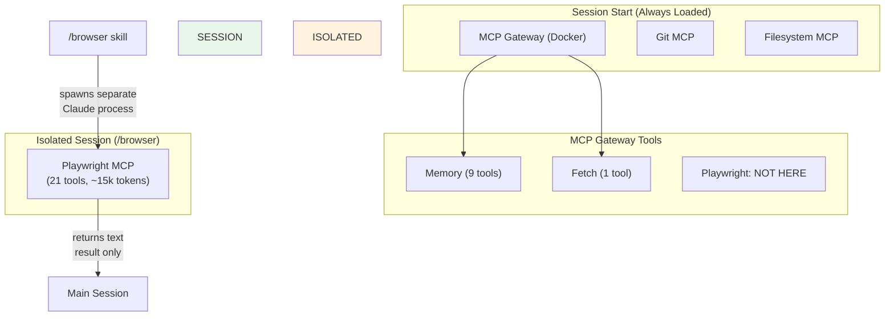
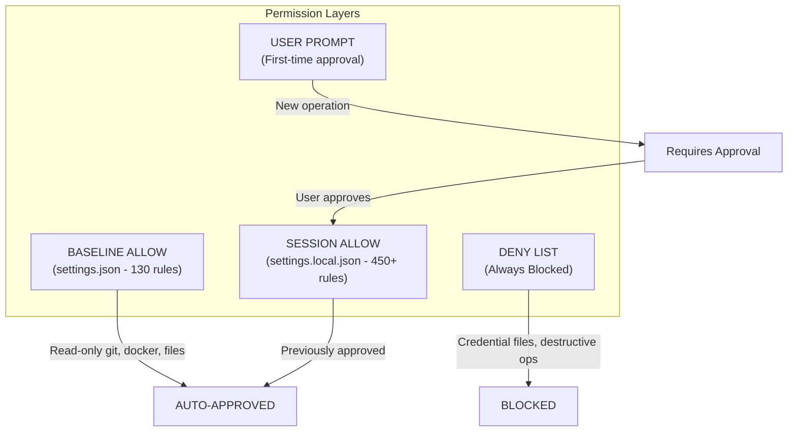
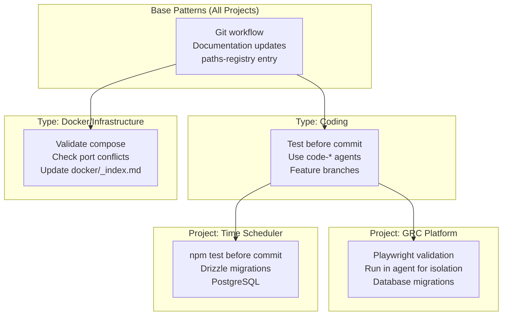

---
tags:
  - project/aiprojects
  - status/draft
  - depth/deep
  - domain/ai
  - domain/infrastructure
created: 2026-01-02T09:36
updated: 2026-01-24T10:44
---
# AIProjects Architecture Overview

> **Purpose**: Central orchestration hub for home lab AI infrastructure
> **Role**: Project Manager for external code projects, Docker services, and automation
> **Philosophy**: Solve once, reuse everywhere; document as you discover

**Last Updated**: 2026-01-02
**Version**: 1.0

---

## Table of Contents

1. [Core Concept](#core-concept)
2. [Design Patterns](#design-patterns)
3. [Context Loading Model](#context-loading-model)
4. [Rule Classification](#rule-classification)
5. [Component Architecture](#component-architecture)
6. [MCP Loading Model](#mcp-loading-model)
7. [Permission Model](#permission-model)
8. [Project-Specific Patterns](#project-specific-patterns)
9. [Quick Reference](#quick-reference)

---

## Core Concept

AIProjects is a **hub, not a container**. It orchestrates but doesn't contain code projects.



### Key Principle

| What | Where | Why |
|------|-------|-----|
| Code projects | `~/Code/<project>/` | Separation of concerns |
| Project context | `.claude/context/projects/<project>.md` | Centralized knowledge |
| Project registration | `paths-registry.yaml` | Single source of truth |
| Docker configs | `~/Docker/mydocker/` | Infrastructure isolation |
| External symlinks | `external-sources/` | Easy access without duplication |

---

## Design Patterns

AIProjects uses several recurring design patterns:

### PARC Pattern (Design Review)
**Prompt → Assess → Relate → Create**

Apply before implementing significant tasks:
1. **Prompt**: What's being asked? Parse the request
2. **Assess**: Do existing patterns apply? Check `.claude/context/patterns/`
3. **Relate**: How does this fit the architecture?
4. **Create**: Apply patterns, document new discoveries

**Invoke**: `/design-review "<task description>"`
**Full docs**: [@.claude/context/patterns/prompt-design-review.md](.claude/context/patterns/prompt-design-review.md)

### DDLA Pattern (Discovery)
**Discover → Document → Link → Automate**

When encountering new systems or patterns:
1. **Discover**: Explore and understand
2. **Document**: Record in context files
3. **Link**: Connect in paths-registry and indexes
4. **Automate**: Create command/workflow if repeated 3+ times

### COSA Pattern (Organization)
**Capture → Organize → Structure → Automate**

For knowledge management:
1. **Capture**: Record information immediately
2. **Organize**: Place in appropriate context file
3. **Structure**: Add to index files
4. **Automate**: Enable discovery through hooks

---

## Context Loading Model

Context is loaded in three tiers based on when it's needed:



### Tier Breakdown

| Tier | When Loaded | Examples | Token Impact |
|------|-------------|----------|--------------|
| **Automatic** | Session start | CLAUDE.md, settings, hooks | ~2-3k tokens |
| **Dynamic** | Action triggers hook | Project detection, MCP suggestions | ~100-500 tokens per trigger |
| **On-Demand** | Explicit @ reference or Read | MCP docs, session notes, knowledge base | Variable |

### @ Reference Behavior

In CLAUDE.md, `@filename` references are **navigation hints**, not automatic loads:
- Claude sees them as "this file exists and is relevant"
- Content is loaded when Claude decides to read it
- Enables discovery without context bloat

### Index Files (Navigation)

Six `_index.md` files serve as table of contents:

| Index | Purpose | Location |
|-------|---------|----------|
| **Master Index** | All context organized | `.claude/context/_index.md` |
| **Docker Index** | 20+ container docs | `.claude/context/systems/docker/_index.md` |
| **Coding Index** | Code project registry | `.claude/context/coding/_index.md` |
| **Logging Index** | Loki/Grafana/Promtail | `.claude/context/systems/logging/_index.md` |
| **Standards Index** | Conventions & terminology | `.claude/context/standards/_index.md` |
| **Patterns Index** | Reusable patterns | `.claude/context/patterns/_index.md` |

---

## Rule Classification

Rules are classified by enforcement level:



### Hard Rules (Always Enforced)

These behaviors **always execute** - they cannot be skipped:

| Rule | Hook/Mechanism | Behavior | Blocking? |
|------|----------------|----------|-----------|
| **Audit Logging** | `audit-logger.js` | Logs ALL tool executions | No (passive) |
| **Session Tracking** | `session-tracker.js` | Records session lifecycle | No (passive) |
| **Secret Scanning** | `secret-scanner.js` | Scans git commits for secrets | **YES** - blocks commit |
| **Branch Protection** | `branch-protection.js` | Prevents force push to main | **YES** - blocks push |
| **Credential Guard** | `credential-guard.js` | Blocks reading .ssh, .env, etc. | **YES** - blocks read |
| **Amend Validation** | `amend-validator.js` | Validates git --amend safety | **YES** - blocks amend |
| **Session Exit** | `session-exit-enforcer.js` | Tracks exit checklist completion | Reminds (tracks) |

### Soft Rules (Contextual Guidance)

These provide **guidance** but don't block operations:

| Rule | Hook/Mechanism | Behavior | Trigger |
|------|----------------|----------|---------|
| **MCP Preference** | `mcp-enforcer.js` | Suggests MCP over Bash | When bash used |
| **Project Validation** | `project-plan-validator` | Validates against patterns | Major proposals |
| **Memory Storage** | `memory-storage-pattern.md` | Guidance on what to store | User discretion |
| **Context Updates** | `context-reminder.js` | Suggests doc updates | After 3+ service interactions |
| **Index Sync** | `index-sync.js` | Alerts on missing index entries | New file created |
| **Paths Registry** | `paths-registry-sync.js` | Warns on unregistered paths | External path used |
| **Priority Tracking** | `priority-validator.js` | Collects work evidence | During session |

### Conditional Rules (Context-Dependent)

These enforce **only when conditions are met**:

| Rule | Hook | Condition | Blocking? |
|------|------|-----------|-----------|
| **Docker Validation** | `docker-validator.js` | On docker-compose commands | Only on errors |
| **Port Conflicts** | `port-conflict-detector.js` | On `docker run -p` | Only if conflict |
| **Docker Health** | `docker-health-check.js` | After Docker modifications | No (verification) |
| **Restart Loops** | `restart-loop-detector.js` | After Docker operations | Warns at 3+, critical at 5+ |
| **Health Monitor** | `health-monitor.js` | Periodic / after Docker ops | Alerts on degradation |

---

## Component Architecture

### Hooks (23 Active)



**Full hook documentation**: [@.claude/hooks/README.md](.claude/hooks/README.md)

### Commands (21 Available)

| Category | Commands | Purpose |
|----------|----------|---------|
| **Infrastructure** | `/check-service`, `/check-gateway`, `/check-health`, `/discover-docker`, `/ollama`, `/ssh-connect`, `/plex-troubleshoot` | Service management |
| **Project Management** | `/create-project`, `/new-code-project`, `/register-project`, `/consolidate-project`, `/update-priorities`, `/sync-git`, `/link-external` | Project lifecycle |
| **Agent & Automation** | `/agent`, `/code`, `/browser`, `/creative` | Task delegation |
| **Design & Workflow** | `/design-review`, `/memory-review` | Pattern application |
| **Logging** | `/audit-log` | Audit management |

**Full command catalog**: [@.claude/commands/README.md](.claude/commands/README.md)

### Agents

```mermaid
graph TB
    subgraph "Custom Agents (/agent)"
        style CUSTOM fill:#e1f5fe
        RESEARCH["deep-research<br/>Multi-source web research"]
        TROUBLE["service-troubleshooter<br/>Systematic diagnosis"]
        DEPLOY["docker-deployer<br/>Guided deployment"]
        OLLAMA["ollama-manager<br/>LLM service control"]
        PLEX["plex-troubleshoot<br/>Plex diagnostics"]
        CODE_A["code-analyzer<br/>Codebase understanding"]
        CODE_I["code-implementer<br/>Code writing"]
        CODE_T["code-tester<br/>Test execution"]
    end

    subgraph "Built-in Subagents (Task tool)"
        style BUILTIN fill:#f3e5f5
        EXPLORE["Explore<br/>Fast codebase search"]
        PLAN["Plan<br/>Architecture design"]
        GUIDE["claude-code-guide<br/>Documentation lookup"]
        FEAT_A["feature-dev:code-architect<br/>Feature design"]
        FEAT_E["feature-dev:code-explorer<br/>Feature analysis"]
        FEAT_R["feature-dev:code-reviewer<br/>Code review"]
        PROJ_V["project-plan-validator<br/>Plan validation"]
    end

    subgraph "Characteristics"
        C_MEM["Has Memory<br/>(learnings.json)"]
        C_ISO["Context Isolation<br/>(own window)"]
        C_RES["Results Files<br/>(structured output)"]
    end

    RESEARCH --> C_MEM
    TROUBLE --> C_MEM
    DEPLOY --> C_MEM

    EXPLORE --> C_ISO
    PLAN --> C_ISO
```



### Decision: When to Use What

| Scenario | Use | Why |
|----------|-----|-----|
| Simple file read | Direct tool (Read) | Single operation |
| Git commit | Skill (`/commit`) | Single-purpose, quick |
| Find files | Built-in (Explore) | Fast, specialized |
| Design new feature | Built-in (feature-dev:code-architect) | Code-focused |
| Recurring troubleshooting | Custom (service-troubleshooter) | Benefits from memory |
| Deploy new service | Custom (docker-deployer) | Complex workflow, docs |
| Browser testing | Skill (`/browser`) | Context isolation |

**Full decision framework**: [@.claude/context/patterns/agent-selection-pattern.md](.claude/context/patterns/agent-selection-pattern.md)

---

## MCP Loading Model

MCP servers have a specific loading behavior that affects context usage:



### How MCP Loading Works

| Aspect | Behavior |
|--------|----------|
| **When loaded** | Session start - all configured MCPs are available immediately |
| **Configuration source** | `.mcp.json` (project) + MCP Gateway (Docker SSE) |
| **Context impact** | Tool definitions consume tokens once loaded |
| **Availability** | All loaded MCP tools available to main session |

### Playwright Isolation Pattern

Playwright MCP is **intentionally excluded** from the main AIProjects session:

| Main Session | Browser Agent (Isolated) |
|--------------|--------------------------|
| MCP Gateway (Memory, Fetch) | Playwright MCP only |
| Git MCP, Filesystem MCP | ~15k tokens of context |
| No Playwright tools | Dedicated browser automation |

**Why isolate?**
- Playwright's 21 tools consume ~15k tokens
- Most sessions don't need browser automation
- `/browser` skill spawns separate Claude process with its own MCP config
- Results return as text summary, keeping main session lean

**How it works:**
```bash
# /browser spawns this:
claude \
  --mcp-config ~/.claude/mcp-profiles/browser.json \  # Only Playwright
  --settings ~/.claude/mcp-profiles/browser-settings.json \
  -p "Task: ..."
```

### Who Can Use Which MCP

| MCP Server | Main Session | /browser Agent | Custom Agents |
|------------|--------------|----------------|---------------|
| Memory | Yes | No | Via Task tool (inherits) |
| Filesystem | Yes | No | Via Task tool (inherits) |
| Git | Yes | No | Via Task tool (inherits) |
| Fetch | Yes | No | Via Task tool (inherits) |
| Playwright | **No** | **Yes** | Only if explicitly configured |

**Key insight**: Custom agents spawned via Task tool inherit the main session's MCP configuration. The `/browser` skill is special because it uses `claude` CLI directly with a different `--mcp-config`.

**Full pattern documentation**: [@.claude/context/patterns/mcp-loading-strategy.md](.claude/context/patterns/mcp-loading-strategy.md) - Decision matrix for Always-On vs On-Demand vs Isolated loading strategies.

---

## Permission Model



### Permission Categories

| Category | Auto-Approved | Requires Approval |
|----------|---------------|-------------------|
| **Git** | status, log, diff, branch, show | commit, push, checkout, reset |
| **Docker** | ps, logs, inspect, images | run, exec, restart, stop |
| **Files** | read, list, search, tree | write, edit, delete |
| **Network** | curl, ping, dig, nc | - |
| **MCP Memory** | read_graph, search_nodes | create_*, delete_* |
| **MCP Browser** | snapshot, console_messages | navigate, click, type |

### Always Blocked

```
# Credential files
~/.ssh/*, .env, *credentials*, *secrets*, *password*, *token*

# Destructive operations
rm -rf /*, mkfs:*, dd if=:*, chmod -R 777 /*
```

**Full permissions**: [@.claude/settings.json](.claude/settings.json)

---

## Project-Specific Patterns

Projects registered in AIProjects can have specific behaviors through:

1. **Context files** in `.claude/context/projects/<name>.md`
2. **Patterns defined** in the context file
3. **Inheritance** from project type (coding, infrastructure, etc.)

### Pattern Inheritance Model



### Example: GRC Platform Specific Rules

From `.claude/context/projects/grc-platform.md`:

```yaml
Project: GRC Platform
Type: Coding (Next.js + Supabase)
Location: ~/Code/grc-platform

Specific Patterns:
  - On major UI changes: Run Playwright validation in isolated agent
  - Database changes: Run Supabase migrations
  - Before commit: TypeScript type check (npx tsc)

Why Isolated Playwright:
  - Playwright MCP consumes ~15k tokens
  - Running in /browser agent keeps main session lean
  - Results return as screenshots + summary
```

### Adding Project-Specific Rules

1. Create/update `.claude/context/projects/<name>.md`
2. Document specific patterns in a clear section
3. Reference in CLAUDE.md if it should be widely known
4. Consider creating hooks if rules should auto-enforce

---

## Quick Reference

### File Locations

| Component | Location |
|-----------|----------|
| Entry point | `.claude/CLAUDE.md` |
| Hooks | `.claude/hooks/*.js` |
| Commands | `.claude/commands/*.md` |
| Agents | `.claude/agents/*.md` |
| Context | `.claude/context/` |
| Knowledge | `knowledge/` |
| Settings | `.claude/settings.json`, `.claude/settings.local.json` |
| External paths | `paths-registry.yaml` |
| Symlinks | `external-sources/` |

### Key Counts

| Component | Count |
|-----------|-------|
| Hooks | 23 active |
| Commands | 21 available |
| Custom Agents | 10+ defined |
| Context Files | 50+ |
| Knowledge Docs | 80+ |
| MCP Servers | 7 active |
| Docker Services | 25+ tracked |

### Common Workflows

| Task | Workflow |
|------|----------|
| Start session | Check `session-state.md` for context |
| End session | Follow exit procedure (hard rule) |
| New code project | `/new-code-project` or `/register-project` |
| Deploy service | `/agent docker-deployer` |
| Troubleshoot | `/agent service-troubleshooter` |
| Design feature | `/design-review` then implement |
| Browser testing | `/browser "<task>"` |

### Links to Dig Deeper

| Topic | Document |
|-------|----------|
| All context files | [.claude/context/_index.md](.claude/context/_index.md) |
| Hook details | [.claude/hooks/README.md](.claude/hooks/README.md) |
| Command catalog | [.claude/commands/README.md](.claude/commands/README.md) |
| Agent system | [.claude/context/systems/agent-system.md](.claude/context/systems/agent-system.md) |
| Agent selection | [.claude/context/patterns/agent-selection-pattern.md](.claude/context/patterns/agent-selection-pattern.md) |
| Memory patterns | [.claude/context/patterns/memory-storage-pattern.md](.claude/context/patterns/memory-storage-pattern.md) |
| MCP loading strategy | [.claude/context/patterns/mcp-loading-strategy.md](.claude/context/patterns/mcp-loading-strategy.md) |
| MCP servers | [.claude/context/integrations/mcp-servers.md](.claude/context/integrations/mcp-servers.md) |
| Session state | [.claude/context/session-state.md](.claude/context/session-state.md) |
| Priorities | [.claude/context/projects/current-priorities.md](.claude/context/projects/current-priorities.md) |

---

## Appendix: Visual Legend

### Rule Types in Diagrams

| Color | Meaning |
|-------|---------|
| Red fill (`#ffcdd2`) | Hard rules (always enforced) |
| Yellow fill (`#fff9c4`) | Soft rules (guidance) |
| Green fill (`#e8f5e9`) | Automatic loading |
| Orange fill (`#fff3e0`) | Dynamic/trigger-based |
| Blue fill (`#e3f2fd`) | On-demand |
| Light blue fill (`#e1f5fe`) | Custom agents |
| Light purple fill (`#f3e5f5`) | Built-in subagents |

### Arrow Types

| Arrow | Meaning |
|-------|---------|
| Solid (`-->`) | Direct relationship |
| Dashed (`-.->`) | Indirect/tracking relationship |
| Labeled arrows | Describe the relationship |

---

## Future Considerations

- [ ] Store architecture overview in Memory MCP for cross-session reference
- [ ] Create `/update-architecture` command for periodic review
- [ ] Add project-specific rule templates
- [ ] Integrate with monthly health checks

---

*This document was generated from a comprehensive analysis of the AIProjects codebase on 2026-01-02.*
